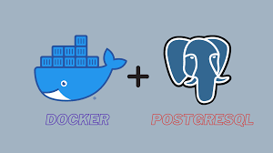
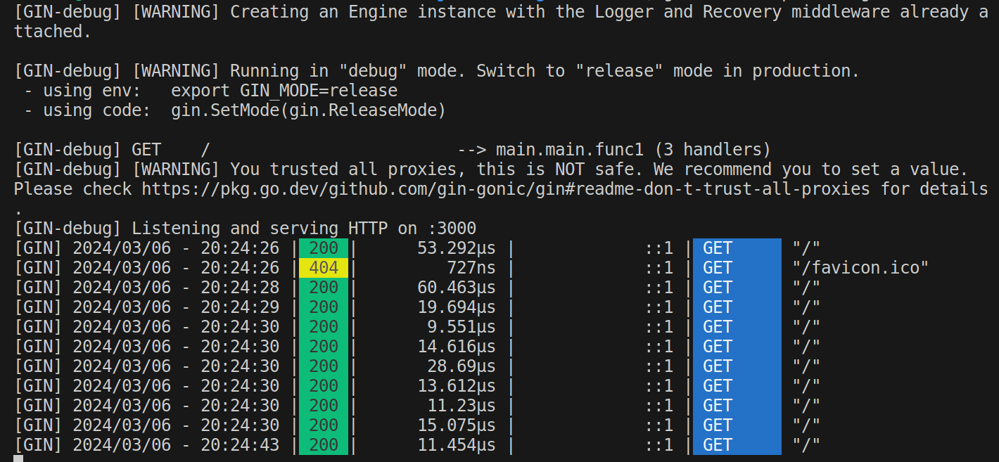

## Projeto APIGOLANG
##Criando API em Golang## 

<h1 align="center"> Descrição </h1>

1. Criação da API em Go: A estrutura da API utiliza o framework web Gin, que é um framework web em Go que fornece uma maneira simples e rápida de criar aplicativos web.

2. Detalhes da Execução:
    

    (a) A aplicação está rodando em modo de depuração (debug mode), como indicado pelas mensagens de log do Gin.
       
    (b) O servidor HTTP está ouvindo na porta:3000, como especificado no código.
       
    (c) Quando uma solicitação HTTP é feita para um servidor, o servidor responde com um código de status HTTP para indicar o resultado da solicitação. 
    • Foram feitas várias solicitações HTTP para o endpoint raiz ("/") da API, e cada solicitação que retornou um código de status 200, indica que a solicitação foi bem-sucedida. 
    • Já para a que indica o código de status 404, em que propositalmente para fins de testes foi feita alteração no caminho, informa que o servidor não consegue encontrar o recurso solicitado. Isso significa que o servidor não conseguiu localizar o recurso solicitado no caminho especificado na URL.
          o código de status 404 indica que o recurso solicitado não foi encontrado no servidor. Isso pode ocorrer por diferentes motivos, como o recurso não existir no servidor ou estar localizado em um caminho diferente.
       
3. Uso do Gin:
        ◦ O Gin fornece um middleware de logger e recuperação automaticamente.
        ◦ O modo de execução do Gin pode ser alterado para modo de produção (release mode) configurando a variável de ambiente GIN_MODE.
        ◦ O Gin também fornece avisos sobre configurações de segurança, como a confiança em todos os proxies.	
       
       
4. Bibliotecas e Tecnologias Utilizadas:
        ◦ A biblioteca ‘github.com/lib/pq’ foi usada para interagir com o banco de dados PostgreSQL.

        ◦ A biblioteca ‘github.com/gin-gonic/gin’ foi usada para criar o servidor web e gerenciar as rotas da API.

Em síntese, a aplicação em Go usando o framework Gin foi executada com sucesso, criando uma API web funcional que responde a solicitações HTTP no endpoint raiz.  

5. Uso de Docker:
    O projeto APIGOLANG utiliza Docker para criar e gerenciar um contêiner do PostgreSQL no projeto Go. O Docker Compose facilita a definição e execução de vários contêineres como um aplicativo único.

        ◦ Configuração do Docker Compose: No arquivo docker-compose.yaml, foi definido o serviço chamado db que utiliza a imagem do PostgreSQL. O serviço é configurado para reiniciar sempre que necessário e expõe o banco de dados na porta 5434 do host. Ele também mapeia o volume postgresql-db-api para persistir os dados do banco de dados.

        ◦ Volumes Docker: O volume postgresql-db-api é definido como externo, o que significa que ele pode ser compartilhado entre diferentes contêineres ou serviços. Isso é útil para garantir a persistência dos dados do banco de dados, mesmo se o contêiner do PostgreSQL seja interrompido ou reiniciado.

6. Versões:
    - Docker: Docker version 25.0.3
    - Banco de Dados PostgreSQL: version: '3.8'
    - Linguagem Go: go version go1.22.0 linux/amd64

-> status do projeto:

